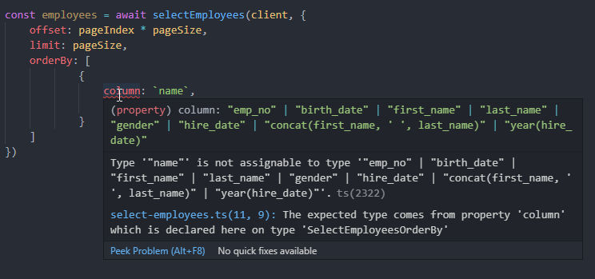

# Order by and limit clauses

You can add placeholders in the order by and limit clauses:

```sql
SELECT 
    emp_no, 
    concat(first_name, ' ', last_name), 
    year(hire_date) 
FROM employees
ORDER BY ?
LIMIT :offset, :limit

```

And can use the generated code as following:

```typescript
const pageIndex = 0;
const pageSize = 10;

const employees = await selectEmployees(client, {
    offset: pageIndex * pageSize,
    limit: pageSize,
    orderBy: [
            {
                column: `first_name`,
                direction: 'asc'
            },
            {
                column: 'last_name',
                direction: 'asc'
            }
    ]
})
```
The code will fail at compile time if you try to pass an invalid order by parameter:
